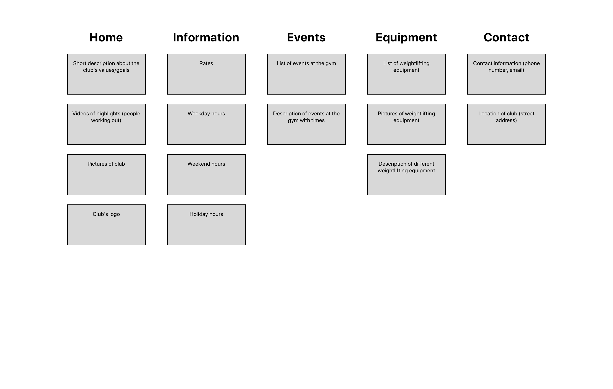
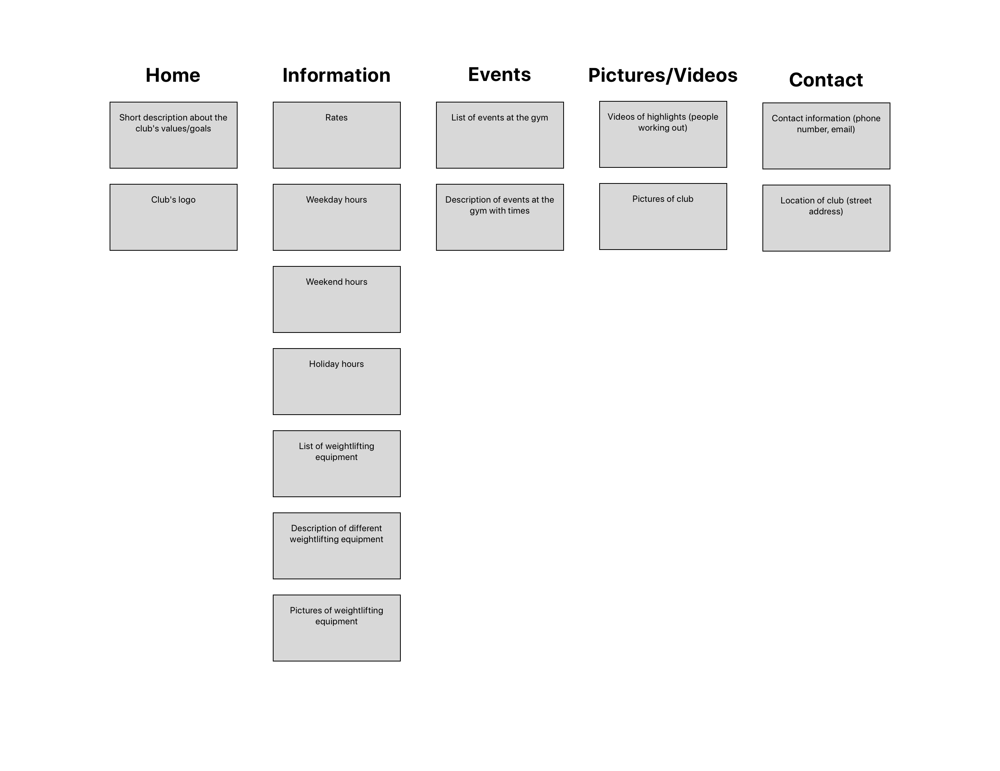

# Project 4 - Design & Plan

Be clear and concise in your writing. Bullets points are acceptable.


# Planning

## Client Description (Milestone 1)
> Tell us about your client. Who is your client? What kind of website do they want? What are their key goals?

Our client is Tom Diliplane from Cayuga Weightlifting Club. Tom wants an informative website that increases the presence of his club around the Ithaca community. He wants to inform his current members about the club's current offerings, events, equipment, and hours. Tom wants to promote the club a little from a competitive standpoint, but his main focus is to inform members.

> NOTE: **If you are redesigning an existing website, give us the current URL and some screenshots of the current site.** Tell us how you plan to update the site in a significant way that meets the Project 4 requirements.


## Site's Purpose (Milestone 1)
> Tell us the purpose of the website and what it is all about.

The purpose of the site is to inform users about the Cayuga Weightlifting Club in Ithaca. The site should provide information about the location of the club, rates, hours, contact information, events, Weightlifting equipment, and highlights at the club (pictures/ videos).

## Client Meeting Notes (Milestone 1)
> Include your notes/minutes from the client meeting, an email they sent you, or whatever you used to keep track of what was discussed at the meeting.

Call #1 (Thursday, November 14)
- Met and talked to Tom about the team
- Discussed forms of communications
  - Using email/text to converse with client
  - Meet in person at end of the project to handoff designs, website, and help deploy
  - Teach client to update information
- Capabilities of our team
  - Code responsive design for both web and mobile
  - Design and code interactivity
  - Design a consistent styling that conveys the message of the company
- Tom shared logo and website information with our team
- Discussed forms of communication, goals for the project, and capabilities of our team
- Tom shared logo and website information


## Client Needs and Wants (Milestone 1)
> Collect your client's needs and wants for the website. Come up with several appropriate design ideas on how those needs may be met. In the **Memo** field, justify your ideas and add any additional comments you have. There is no specific number of needs required for this, but you need enough to do the job.

Needs/Wants: The client owns the gym in Ithaca, which a smaller, local community and needs to spread the word about the club as well as disseminate information about the club.
- **Needs and Wants** [What does your client need and want?]
  - Tom wants to communicate information about his club to his current members and prospective customers. In particular, he wants information about:
    - Equipment/videos of lifts
    - Open lifting hours
    - Rates for classes
    - Events at the gym
    - Contact information/location
- **Design Ideas and Choices** [How will you meet those needs and wants?]
  - We will create a website with pages for each of the content requirements that Tom outlined
  - We will organized the pages in an order that best prioritizes the user needs
- **Memo** [Justify your decisions; additional notes.]
  - Since Tom is looking for something that will best provide information rather than focusing on customers, we will use a lot more text and make sure descriptions are well-worded

Needs/Wants: The client would like to attract more customers with the website, and improve his business.  
- **Needs and Wants**
  - Tom would like to attract more customers to grow his business.
- **Design Ideas and Choices**
  - We plan to create a very appealing design that showcases the interior of the gym (through pictures). The website should also reflect the energetic theme to convey emotions of excitement.
- **Memo**
  - Users find pictures more helpful than text when trying to show weightlifting equipment and the overall atmosphere of the gym. Images will help customers get an overall "sense" of the gym.

Needs/Wants: For current gym members, the client wants to host a site that can provide daily information about the gym and inform members about upcoming events.    
- **Needs and Wants**
  - Tom wants to inform gym members of upcoming events and daily information about the club.
- **Design Ideas and Choices**
  - We are dedicating an entire page to events, where Tom can update the information to inform members of upcoming events at the gym.
- **Memo**
  - We are meeting with Tom at the end of the project to teach him how to update the html to add new information to the events page.

## User(s) (Milestone 1)
> Tell us about the users (target audience) for this website.

The target audience for this website is current club members and anyone in the Ithaca area who is interested in joining a weightlifting club.

## Discovering Users' Needs (Milestone 1)
> You'll need to discover your users' needs. Talk to them! Document what you've learned about them. When talking to your users, take notes and include those notes here.


## Users' Needs (Milestone 1)
> Analyze the users' needs and wants from your notes above. List each need/want below. There is no specific number of needs required for this, but you need enough to do the job.
> **Note:** These are probably *not* the needs of your client.

Need/Want: Logistics
- **Needs and Wants** [What do the users need and want?]
  - Users  need to know important info about the logistics of the Club (location, hours, prices, etc.) They want to see what will be there upon arrival// see what the club looks like.
- **Design Ideas and Choices** [How will you meet those needs and wants?]
  - Add pages that address these issues, make sure the user is informed. Photo galleries will be included allowing users to see what the club looks like/ what materials are there
- **Rationale & Additional Notes** [Justify your decisions; additional notes.]
  - Club goers need to be informed and should be able to get a feel for what they could potentially be signing up for. Thus, it is important to include logistical information on the website.

Need/Want: Communication
- **Needs and Wants** [What do the users need and want?]
  -  Users need to be able to get a clear understanding of what the club offers, and want to see what the workout space looks like.  
- **Design Ideas and Choices** [How will you meet those needs and wants?]
  - Feedback form allows users to contact the club and give feedback.
- **Rationale & Additional Notes** [Justify your decisions; additional notes.]
  - Club goers can fill out the feedback form and suggest member bonding events, or any information they want to request.

Need/Want: Transparency
- **Needs and Wants** [What do the users need and want?]
  -  Users need to be able to get a clear understanding of what the club offers, and want to see what the workout space looks like.  
- **Design Ideas and Choices** [How will you meet those needs and wants?]
  - Many images throughout the site and descriptive pages giving users more info about the club.
- **Rationale & Additional Notes** [Justify your decisions; additional notes.]
  - Using images instead of more text allows for a greater variety of content types and makes the site more aesthetically appealing for the user.

## User Testing Plan (Milestone 1)
> Plan out your tasks for evaluating whether your site will meet the needs of the users. These must be actual user testing tasks. Tasks are not questions!

1. You want to go to the Cayuga Weightlifting Club on Saturday at 3 pm. Find out if the club will be open.

2. Find out the rates for using the gym.

3. You want to use a squat rack at the Cayuga Weightlifting Club. Find out if the gym has this machine.

4. Find the address for the club.


## Content (Milestone 1)
> Plan out your site's content (text, images, etc.). Make a list of **all** the content you will need. This list should be **exhaustive**.

- A short description about the club's values/goals (on homepage)
- clubs logo (include on each page at top)
- Club's hours
  - weekdays
  - weekends
  - maybe times for holidays
- Rates
- Contact information
  - phone number
  - email?
  - location of club (street address)
- Gym events
  - Description of each event with time
- Description of different weightlifting equipment
- Pictures of weightlifting equipment
- Videos of highlights (people working out)

## Interactivity Ideas (Milestone 1)
> Come up with some idea for interactive features for your site.

- Scroll to top
- Image gallery
- Event form
- Enlarge image on click
- Hamburger menu
- Calendar for events pages
- Dark mode

# Design & Evaluation

## Design Process (Milestone 1)
> Document your design process. Show us your card sorting. Design your navigation from the card sorting. Outline your navigation. Describe your theme. Show us sketches of your site (mobile and desktop versions). etc.
> You should show us how your came up with your design and how your iterated on that design; show us the evolution of your design.

Theme: The theme of the website will be energetic with an Ithaca vibe. The theme is meant to excite the user about the gym and explore other pages of the site.

> **Note:** Card sorting is used to organize your site's content. For each piece of content identified in the previous section, write a summary of that content onto a card. Now sort the cards. The grouping of cards provides you with your pages for your website. **Do not write down the pages you want and then "card sort" those. That is not card sorting.**

**Card Sorting**

Card Sort 1


Card Sort 2


Card Sort 3


Card Sort 4


Card Sort 5


We decided to go with the 4th card sort. We found that this card sort best grouped the content of the website. In other card sorts the group names were not specific enough (ex: "information"), and this is not helpful in directing the user to the information they are looking for. The 4th card sort has group names that are specific enough, so the user knows exactly what type of information is on each page. Additionally, this card sort ensures that there is not too much content within a page. The card sort creates pages with a good amount of content that are easy to navigate to via the group names.

  <--- Mobile Sketches
  <--- Desktop Sketches


## Interactivity (Milestone 1)
> What interactive features will your site have? Describe how the interactivity connects with the needs of the clients/target audience.

- Image gallery
  - In order to properly inform our target audience about the club, we should allow users to change pictures and see more of the club by clicking a button
- Scroll to top
  - Since pages can sometimes be long, we want users to easily access the navigation bar at all time for better usability
  - Scroll to top will only show up when the user scrolls past a certain part in the page
- Event form
  - If someone wants to host an event at the club, we should have them fill out a form so that Tom has some initial details about what the event might be and why the club is a good fit

## User Testing (_optional_)
> This testing is optional.

### User 1 - Testing Notes (Milestone 1)
> When conducting user testing, you should take notes during the test. Place your notes here.


### User 1 (Milestone 1)
> Using your notes from above, describe your user by answering the questions below.

1. Who is your user, e.g., where does the user come from, what is the user's job, characteristics, etc.?


2. Does the user belong to your target audience of the site? (Yes / No)
> If “No”, what’s your strategy of associating the user test results to your target audience’s needs and wants? How can your re-design choices based on the user tests make a better fit for the target audience?


### User 1 - **Desktop** (Milestone 1)
> Report the results of your user's evaluation. You should explain **what the user did**, describe the user's **reaction/feedback** to the design, **reflect on the user's performance**, determine what **re-design choices** you will make. You can also add any additional comments. See the example design journey for an example of what this would look like.

Task: [TODO: copy task here]
- **Did you evaluate the desktop or mobile design?**
  - Pick one: desktop/mobile
- **How did the user do? Did they meet your expectation?**
  - TODO
- **User’s reaction / feedback to the design** (e.g., specific problems or issues found in the tasks)
  - TODO
- **Your reflections about the user’s performance to the task**
  - TODO
- **Re-design choices**
  - TODO
- **Additional Notes**
  - TODO: Justify your decisions; additional notes.

...


### User 2 - Testing Notes (Milestone 1)
> When conducting user testing, you should take notes during the test. Place your notes here.


### User 2 (Milestone 1)
> Using your notes from above, describe your user by answering the questions below.

1. Who is your user, e.g., where does the user come from, what is the user's job, characteristics, etc.?


2. Does the user belong to your target audience of the site? (Yes / No)
> If “No”, what’s your strategy of associating the user test results to your target audience’s needs and wants? How can your re-design choices based on the user tests make a better fit for the target audience?


### User 2 - **Mobile** (Milestone 1)
> Report the results of your user's evaluation. You should explain **what the user did**, describe the user's **reaction/feedback** to the design, **reflect on the user's performance**, determine what **re-design choices** you will make. You can also add any additional comments. See the example design journey for an example of what this would look like.

Task: [TODO: copy task here]
- **Did you evaluate the desktop or mobile design?**
  - Pick one: desktop/mobile
- **How did the user do? Did they meet your expectation?**
  - TODO
- **User’s reaction / feedback to the design** (e.g., specific problems or issues found in the tasks)
  - TODO
- **Your reflections about the user’s performance to the task**
  - TODO
- **Re-design choices**
  - TODO
- **Additional Notes**
  - TODO: Justify your decisions; additional notes.

...


## Final Design (Milestone 1)
> Include the final sketches for each of your pages. These sketches **must** hand-drawn.

**Desktop Design:**

  <--- Desktop Sketches

**Mobile Design:**

  <--- Mobile Sketches


## Additional Comments (Milestone 1)
> If you feel like you haven't fully explained your design choices, or if you want to explain some other functions in your site (such as special design decisions that might not meet the Project 4 requirements), you can use this space to justify your design choices or ask other questions about the project and process.


---

# Iteration 2

## Client Feedback (Milestone 2)
> You have met once with your client a second time to discuss your initial design. Include your notes from the meeting, an email they sent you, or whatever you used to keep track of what was discussed at the meeting. Write a few sentences about the design feedback you received from your client.

Call #2 (Saturday, November 16)
- Goals for the project
  - Create a usable website for current members
    - Add information about hours, facilities, and equipment
    - Add some marketing materials in the form of highlights or events
  - Allow client to update the website for current events
- Tom handed off some content to us
  - Logo
  - Information about rates
  - Possible bio for an "About" page
- Talked through what pages we might want to have
  - Homepage
  - Equipment
  - Events
  - Pictures/Videos
  - Contact

  Tom also sent us some design feedback in the form of text after we sent him the designs via email:

  

  I think that Tom is much more focused on the content rather than the layout (which we've designed to be pretty standard). I imagine that wee will have more feedback going forward once we've listed out content on the site and talked more about the language we use for copy.

## Interactivity Plan (Milestone 2)
> Write your interactivity pseudocode here.

Image Gallery:
```
when DOM is loaded:

  if right button is pressed:
    if video 1 is visible:
      hide video 1
      show video 2
    else if video 2 is visible:
      hide video 2
      show video 3
    else if video 3 is visible:
      hide video 3
      show video 1

  if left button is pressed:
    if video 3 is visible:
      hide video 3
      show video 2
    else if video 2 is visible:
      hide video 2
      show video 1
    else if video 1 is visible:
      hide video 1
      show video 3

```

Scroll to top:
```
when DOM is loaded:

  if window is scrolled down 20 pixels:
    show scroll to top button
  else:
    hide scroll to top button

```

Event form:
```
when DOM is loaded:
  when form is submitted:
    formValid <- true
    if name meets HTML5 validation criteria:
      hide name feedback
    else:
      show name feedback
      formValid <- false
    if email meets HTML5 validation criteria:
      hide email feedback
    else:
      show email feedback
      formValid <- false
    if event meets HTML5 validation criteria:
      hide event feedback
    else:
      show event feedback
      formValid <- false
  return formValid
```

Contact form:
```
when DOM is loaded
  when form is submitted:
    formValid <- true
    if name meets HTML5 validation criteria:
      hide name feedback
    else:
      show name feedback
      formValid <- false
    if email meets HTML5 validation criteria:
      hide email feedback
    else:
      show email feedback
      formValid <- false
    if message meets HTML5 validation criteria:
      hide message feedback
    else:
      show message feedback
      formValid <- false
  return formValid
```
## Additional Comments (Milestone 2)
> If you feel like you haven't fully explained your design choices, or if you want to explain some other functions in your site (such as special design decisions that might not meet the Project 4 requirements), you can use this space to justify your design choices or ask other questions about the project and process.


---

# Iteration 3

## Additional Comments (Milestone 3)
> If you feel like you haven't fully explained your design choices, or if you want to explain some other functions in your site (such as special design decisions that might not meet the Project 4 requirements), you can use this space to justify your design choices or ask other questions about the project and process.

Previous emails with Tom:


---

# Final Evaluation

## Changes Based on Lab 13 Peer Feedback (Final Submission)
> What changes did you make to your design based on your peers' feedback?

Our peers' feedback mentioned fixing the mobile version of the website so that users are not scrolling through a lot of content that might not all be important or relevant to them. To address this feedback, we removed some of the images from the mobile design so that users are only left with the most important content. We also refined the spacing and alignment on the mobile version of the website. Other feedback we received was about the spacing on the home page. We decided to move the summary text to below the video on the home page to address this feedback and have more consistent spacing. We also added more information to the home page that users might want to have easy access to (e.g. location, hours, rates). Finally, based on feedback, we fixed the alignment of both the event and contact forms so that they are aligned to the left instead of the center to be consistent with the rest of their respective pages.

## User Testing
> If you conducted user testing in Milestone 1, you only need to user test 2 more users. Otherwise, you must conduct user testing with 4 users.

#### Tasks
1. You want to go to the Cayuga Weightlifting Club on Saturday at 3 pm. Find out if the club will be open.

2. Find out what the rates for using the gym are.

3. You want to use a squat rack at the Cayuga Weightlifting Club. Find out if the gym has this machine.

4. Find the address for the club.

### User 3 - Testing Notes (Final Submission)
> When conducting user testing, you should take notes during the test. Place your notes here.


### User 3 (Final Submission)
> Using your notes from above, describe your user by answering the questions below.

1. Who is your user, e.g., where does the user come from, what is the user's job, characteristics, etc.?
User is from Texas. User enjoys working out and works out 5 times a week at Noyes on West Campus.  

2. Does the user belong to your target audience of the site? (Yes / No)
> If “No”, what’s your strategy of associating the user test results to your target audience’s needs and wants? How can your re-design choices based on the user tests make a better fit for the target audience?

Yes

### User 3 - **Desktop** (Final Submission)
> Report the results of your user's evaluation. You should explain **what the user did**, describe the user's **reaction/feedback** to the design, **reflect on the user's performance**, determine what **re-design choices** you will make. You can also add any additional comments. See the example design journey for an example of what this would look like.

Task: You want to go to the Cayuga Weightlifting Club on Saturday at 3 pm. Find out if the club will be open.
- **Did you evaluate the desktop or mobile design?**
  - Pick one: desktop
- **How did the user do? Did they meet your expectation?**
  - The user quickly completed the task; clicked on hours page through nav bar and then found hours info for specific day quickly.
- **User’s reaction / feedback to the design** (e.g., specific problems or issues found in the tasks)
  - User found the design accessible and easy to use.
- **Your reflections about the user’s performance to the task**
  - I am happy with how fast the user completed the task.
- **Re-design choices**
  - I do not plan on changing the design.
- **Additional Notes**
  - N/A

- Task: Find out the rates for using the gym.
  - **Did you evaluate the desktop or mobile design?**
    - Pick one: desktop
  - **How did the user do? Did they meet your expectation?**
    - User clicked on rates page and scrolled to find the different package prices
  - **User’s reaction / feedback to the design** (e.g., specific problems or issues found in the tasks)
    - User found the design easy to use, and enjoyed the pictures on right column. User, however, recommended that we move the unlimited training rates to the top because this is probably what most users are interested in.
  - **Your reflections about the user’s performance to the task**
    - I am happy with how the user completed the task, but I am going to consider moving rate content around to make the page more usable.
  - **Re-design choices**
    - I might move unlimited training content to top.
  - **Additional Notes**
    - N/A

- Task: You want to use a squat rack at the Cayuga Weightlifting Club. Find out if the gym has this machine.
  - **Did you evaluate the desktop or mobile design?**
    - Pick one: desktop
  - **How did the user do? Did they meet your expectation?**
    - User found the information by clicking on the equipment page, and then saw that squat rack was offered at the gym.
  - **User’s reaction / feedback to the design** (e.g., specific problems or issues found in the tasks)
    - User found it very accessible and easy to use, and also enjoyed the pictures on the page.
  - **Your reflections about the user’s performance to the task**
    - I am happy with how the user performed.
  - **Re-design choices**
    - I do not plan to change the design.
  - **Additional Notes**
    - N/A

- Task: Find the address for the club.
  - **Did you evaluate the desktop or mobile design?**
    - Pick one: desktop
  - **How did the user do? Did they meet your expectation?**
    - User clicked on contact page and found address immediately (listed at top)
  - **User’s reaction / feedback to the design** (e.g., specific problems or issues found in the tasks)
    - User had no problems with the design and completed the task effortlessly.
  - **Your reflections about the user’s performance to the task**
    - I am happy with how the user completed the task.
  - **Re-design choices**
    - I do not plan to redesign this aspect of the website.
  - **Additional Notes**
    - N/A


### User 4 - Testing Notes (Final Submission)
> When conducting user testing, you should take notes during the test. Place your notes here.


### User 4 (Final Submission)
> Using your notes from above, describe your user by answering the questions below.

1. Who is your user, e.g., where does the user come from, what is the user's job, characteristics, etc.?

User is from SoCal. User works out 6 times a week at Teagle.  

2. Does the user belong to your target audience of the site? (Yes / No)

Yes


### User 4 - **Mobile** (Final Submission)
> Report the results of your user's evaluation. You should explain **what the user did**, describe the user's **reaction/feedback** to the design, **reflect on the user's performance**, determine what **re-design choices** you will make. You can also add any additional comments. See the example design journey for an example of what this would look like.

Task: You want to go to the Cayuga Weightlifting Club on Saturday at 3 pm. Find out if the club will be open.
- **Did you evaluate the desktop or mobile design?**
  - Pick one: mobile
- **How did the user do? Did they meet your expectation?**
  - User went to hours page and met expectations for finding time
- **User’s reaction / feedback to the design** (e.g., specific problems or issues found in the tasks)
  - User had no reaction/did not get frustrated
- **Your reflections about the user’s performance to the task**
  - No plans to change the design
- **Re-design choices**
  - TODO
- **Additional Notes**
  - N/A

- Task: Find out the rates for using the gym.
  - **Did you evaluate the desktop or mobile design?**
    - Pick one: mobile
  - **How did the user do? Did they meet your expectation?**
    - User clicked on rates page and scrolled through prices
    - She wasn't sure which price to tell us
  - **User’s reaction / feedback to the design** (e.g., specific problems or issues found in the tasks)
    - User said all the prices out loud but said that the would probably use unlimited training
  - **Your reflections about the user’s performance to the task**
    - I'm glad the navigation worked well, but think there's opportunity to make the rates page better
  - **Re-design choices**
    - Unlimited training would be more important for the user, so many move that to the top
  - **Additional Notes**
    - N/A

- Task: You want to use a squat rack at the Cayuga Weightlifting Club. Find out if the gym has this machine.
  - **Did you evaluate the desktop or mobile design?**
    - Pick one: mobile
  - **How did the user do? Did they meet your expectation?**
    - User navigates to Equipment page and found the squat rack easily
  - **User’s reaction / feedback to the design** (e.g., specific problems or issues found in the tasks)
    - User had no reaction and found the site working well
  - **Your reflections about the user’s performance to the task**
    - I'm happy that the user completed the task efficiently
  - **Re-design choices**
    - No design changes
  - **Additional Notes**
    - N/A

- Task: Find the address for the club.
  - **Did you evaluate the desktop or mobile design?**
    - Pick one: mobile
  - **How did the user do? Did they meet your expectation?**
    - User scrolled down the homepage and found the address easily
  - **User’s reaction / feedback to the design** (e.g., specific problems or issues found in the tasks)
    - User said she found the address on the homepage where she expected to find it
  - **Your reflections about the user’s performance to the task**
    - I'm happy with the way the task went
  - **Re-design choices**
    - No design changes
  - **Additional Notes**
    - N/A

### User 5 - Testing Notes (Final Submission)
> When conducting user testing, you should take notes during the test. Place your notes here.


### User 5 (Final Submission)
> Using your notes from above, describe your user by answering the questions below.

1. Who is your user, e.g., where does the user come from, what is the user's job, characteristics, etc.?
My user is originally from Chicago but currently lives in Milwaukee, Wisconsin. He works out once a week at Noyes. He also plays tennis in his free time.

2. Does the user belong to your target audience of the site? (Yes / No)
> If “No”, what’s your strategy of associating the user test results to your target audience’s needs and wants? How can your re-design choices based on the user tests make a better fit for the target audience?

Yes


### User 5 - **Desktop** (Final Submission)
> Report the results of your user's evaluation. You should explain **what the user did**, describe the user's **reaction/feedback** to the design, **reflect on the user's performance**, determine what **re-design choices** you will make. You can also add any additional comments. See the example design journey for an example of what this would look like.

Task: You want to use a squat rack at the Cayuga Weightlifting Club. Find out if the gym has this machine.
- **Did you evaluate the desktop or mobile design?**
  - Pick one: desktop
- **How did the user do? Did they meet your expectation?**
  - The user quickly completed the task. He went to the equipment page and looked through the list. Then he found squat rack in the list.
- **User’s reaction / feedback to the design** (e.g., specific problems or issues found in the tasks)
  - User found the design easy to use.
- **Your reflections about the user’s performance to the task**
  - I am happy with how fast the user completed the task.
- **Re-design choices**
  - I do not plan on changing the design.
- **Additional Notes**
  - N/A

- Task: Find the address for the club.
  - **Did you evaluate the desktop or mobile design?**
    - Pick one: desktop
  - **How did the user do? Did they meet your expectation?**
    - User went to the home page, but didn't scroll down enough to see the address. Then he went to the contact page and found the address of the club.
  - **User’s reaction / feedback to the design** (e.g., specific problems or issues found in the tasks)
    - User found the design easy to use. He did wonder why there were two emails on the contact page.
  - **Your reflections about the user’s performance to the task**
    - I am happy that the user was able to find the address quickly on the contact page.
  - **Re-design choices**
    - I might remove Tom's personal email from the contact page to avoid confusion.
  - **Additional Notes**
    - N/A

- Task: Find out the rates for using the gym.
  - **Did you evaluate the desktop or mobile design?**
    - Pick one: desktop
  - **How did the user do? Did they meet your expectation?**
    - User found the information by clicking on the rates page and looking at the list of packages.
  - **User’s reaction / feedback to the design** (e.g., specific problems or issues found in the tasks)
    - User reacted well to the design of the website.
  - **Your reflections about the user’s performance to the task**
    - I am happy with how the user performed. The user did mention that the unlimited and one-on-one packages interested him the most.
  - **Re-design choices**
    - I might move the unlimited and one-on-one packages to the top of the page.
  - **Additional Notes**
    - N/A

- Task: You want to go to the Cayuga Weightlifting Club on Saturday at 3 pm. Find out if the club will be open.
  - **Did you evaluate the desktop or mobile design?**
    - Pick one: desktop
  - **How did the user do? Did they meet your expectation?**
    - User went to the hours page, scrolled down to the weekend section, and saw that the club was open.
  - **User’s reaction / feedback to the design** (e.g., specific problems or issues found in the tasks)
    - User reacted well to the design of the website and completed the task easily.
  - **Your reflections about the user’s performance to the task**
    - I am happy with how the user completed the task.
  - **Re-design choices**
    - I do not plan to redesign this aspect of the website.
  - **Additional Notes**
    - N/A

...


### User 6 - Testing Notes (Final Submission)
> When conducting user testing, you should take notes during the test. Place your notes here.


### User 6 (Final Submission)
> Using your notes from above, describe your user by answering the questions below.

1. Who is your user, e.g., where does the user come from, what is the user's job, characteristics, etc.?
New York City Manhattan
when i'm away from cornell i work out a lot
work out twice a week at Noyes
cardio

2. Does the user belong to your target audience of the site? (Yes / No)
> If “No”, what’s your strategy of associating the user test results to your target audience’s needs and wants? How can your re-design choices based on the user tests make a better fit for the target audience?

Yes

### User 6 - **Mobile** (Final Submission)
> Report the results of your user's evaluation. You should explain **what the user did**, describe the user's **reaction/feedback** to the design, **reflect on the user's performance**, determine what **re-design choices** you will make. You can also add any additional comments. See the example design journey for an example of what this would look like.

Task: You want to use a squat rack at the Cayuga Weightlifting Club. Find out if the gym has this machine.
- **Did you evaluate the desktop or mobile design?**
  - Pick one: mobile
- **How did the user do? Did they meet your expectation?**
  - The user clicked on the equipment page and found the squat rack in the list of equipment.
- **User’s reaction / feedback to the design** (e.g., specific problems or issues found in the tasks)
  - User responded well to the design.
- **Your reflections about the user’s performance to the task**
  - I am happy with how fast the user completed the task.
- **Re-design choices**
  - I do not plan on changing the design.
- **Additional Notes**
  - N/A

Task: You want to go to the Cayuga Weightlifting Club on Saturday at 3 pm. Find out if the club will be open.
- **Did you evaluate the desktop or mobile design?**
  - Pick one: mobile
- **How did the user do? Did they meet your expectation?**
  - The user clicked on the hours page and scrolled to the bottom and saw that the club was open.
- **User’s reaction / feedback to the design** (e.g., specific problems or issues found in the tasks)
  - User seemed to react well to the design of the website and found the hours easily.
- **Your reflections about the user’s performance to the task**
  - I am happy with how fast the user completed the task.
- **Re-design choices**
  - I do not plan on changing the design.
- **Additional Notes**
  - N/A

Task: Find the address for the club.
- **Did you evaluate the desktop or mobile design?**
  - Pick one: mobile
- **How did the user do? Did they meet your expectation?**
  - The user found the address on the home page.
- **User’s reaction / feedback to the design** (e.g., specific problems or issues found in the tasks)
  - User seemed to react well to the design of the website and found the address easily.
- **Your reflections about the user’s performance to the task**
  - I am happy with how fast the user completed the task. I'm happy that the user found the address on the home page instead of the contact page.
- **Re-design choices**
  - I do not plan on changing the design.
- **Additional Notes**
  - N/A

Task: Find out the rates for using the gym.
- **Did you evaluate the desktop or mobile design?**
  - Pick one: mobile
- **How did the user do? Did they meet your expectation?**
  - The user clicked on the rates page and scrolled through the packages. He said he would probably do the four week training program.
- **User’s reaction / feedback to the design** (e.g., specific problems or issues found in the tasks)
  - User seemed to react well to the design of the website and found the rates easily.
- **Your reflections about the user’s performance to the task**
  - I am happy with how fast the user completed the task.
- **Re-design choices**
  - I do not plan on changing the design.
- **Additional Notes**
  - N/A


...


## Changes Based on User Testing (Final Submission)
> What changes did you make to your design based on user testing?

We changed the order of the content on the rates page based on user 3 test. Now, unlimited training prices are the first thing on the page since that's the most useful information for the users. We also removed Tom's personal email from the contact page since a user was confused about which contact was appropriate for the club.

## Final Notes to the Graders (Final Submission)
> 1. Give us three specific strengths of your site that sets it apart from the previous website of the client (if applicable) and/or from other websites. Think of this as your chance to argue for the things you did really well.

The client did not have a previous site, and relied on a facebook page that was not very informative.

1. With the website, the client now can inform users of the club's hours and provide easy access to information. Our website has a very clean and energetic design that reflects the attitude of the gym.

2. Another strength of the site is the organization of the pages by the nav bar. Users can easily access relevant information with the nav bar.

3. Our site also has interesting graphics that enhance the content of the page. For example, on the home page, the video gallery makes the page interactive and more interesting, which plays to the site's energetic theme.      

> 2. Tell us about things that don't work, what you wanted to implement, or what you would do if you keep working with the client in the future. Give justifications.

Some things that don't work is the ability to add new events and keep information stored on some type of backend. Ideally, if we had more time with the client, we would also produce more iteration and several directions before creating the rest of the pages. I think working with the client and really seeing the users AT the gym would have been helpful had we had more time as well.

> 3. Tell us what you, as a team, learned while working on this project.

As a team, we learned how to work together and work remotely using Git. We also learned that group projects are a great way to make friends and get to know other people in our major. We had some issues making sure that we weren't deleting people's work, but we met up and overcame this obstacle. In the future, I think one way for us to improve is to learn how to read others' code and reduce some of the redundancy.

> 4. Tell us anything else you need us to know for when we're looking at the project.
